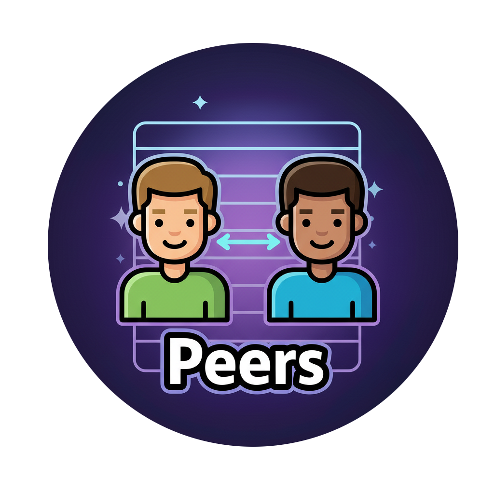
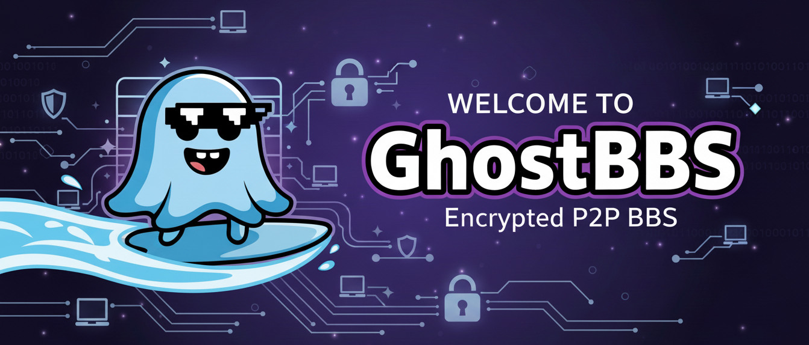

# BBS P2P - Decentralized Encrypted Bulletin Board System

A modern, peer-to-peer bulletin board system with end-to-end encryption, built with Python, Qt, and QFluentWidgets.

## Features

- 🔐 **End-to-End Encryption**: All messages encrypted with forward secrecy
- 🌐 **Decentralized**: No central servers, pure P2P architecture
- 🔍 **Auto-Discovery**: Automatic peer discovery via mDNS (LAN) and DHT (Internet)
- 💬 **Threaded Discussions**: Organize conversations in boards and threads
- 📨 **Private Messaging**: Encrypted direct messages between peers
- 📎 **File Sharing**: Attach files to posts and messages
- 🎨 **Modern UI**: Fluent Design interface with dark/light themes
- 🛡️ **Moderation**: Cryptographically signed moderation actions
- ✅ **Verified Identity**: Ed25519 signatures on all posts

## Screenshots

### Discussion Boards

*Browse and create discussion boards with a modern, card-based interface*

### Private Chats

*Encrypted peer-to-peer messaging with conversation management*

### Peer Monitor

*Monitor connected peers, network status, and manage trust relationships*

### Application Interface

*Clean, modern interface with consistent purple theme throughout*

## Architecture

The application is built with a clean layered architecture:

- **UI Layer**: PySide6 + QFluentWidgets (Fluent Design)
- **Application Logic**: Board, Thread, Chat, and Moderation managers
- **Networking**: Asyncio-based P2P with mDNS discovery
- **Cryptography**: Ed25519 signing + X25519 encryption
- **Storage**: SQLite + SQLAlchemy ORM
- **Sync**: Vector clock-based conflict resolution

## Requirements

### All Platforms
- Python 3.11 or higher
- 4GB RAM minimum (8GB recommended)
- 500MB free disk space

### Windows-Specific
- Windows 10 or later (64-bit)
- Microsoft Visual C++ Redistributable 2015-2022

### Linux-Specific
- Qt6 libraries
- OpenSSL 1.1.1 or later
- X11 or Wayland display server

### macOS-Specific
- macOS 10.15 (Catalina) or later

## Installation

### Windows Requirements

Before installing on Windows, ensure you have:

1. **Python 3.12
   - Download from [python.org](https://www.python.org/downloads/)
   - During installation, check "Add Python to PATH"

2. **Microsoft Visual C++ Redistributable**
   - Required for PySide6
   - Download from [Microsoft](https://aka.ms/vs/17/release/vc_redist.x64.exe)

3. **Git** (optional, for cloning)
   - Download from [git-scm.com](https://git-scm.com/download/win)

### Windows Installation Steps

```powershell
# Clone the repository (or download ZIP)
git clone https://github.com/netcore3/GBB.git
cd GBB

# Create virtual environment
python -m venv venv

# Activate virtual environment
venv\Scripts\activate

# Upgrade pip
python -m pip install --upgrade pip

# Install dependencies
pip install -r requirements.txt

# Run the application
python main.py
```

### Debian/Ubuntu Requirements

Before installing on Debian-based systems, ensure you have the required system dependencies:

```bash
# Update package list
sudo apt update

# Install Python development headers and build tools
sudo apt install python3.11 python3.11-dev python3.11-venv build-essential

# Install Qt libraries for PySide6
sudo apt install qt6-base-dev qt6-tools-dev qt6-websockets-dev

# Install networking and cryptography dependencies
sudo apt install libssl-dev libffi-dev

# Install additional system libraries
sudo apt install pkg-config cmake

# Install Qt platform plugin dependencies
sudo apt install libxcb-cursor0
```

### Linux/macOS Installation Steps

```bash
# Clone the repository
git clone https://github.com/yourusername/bbs-p2p.git
cd bbs-p2p

# Create virtual environment
python3.11 -m venv venv
source venv/bin/activate  # On macOS: source venv/bin/activate

# Install dependencies
pip install -r requirements.txt

# Run the application
python main.py
```

### Demo Mode

Test the P2P functionality locally by running multiple instances:

**Windows (PowerShell):**
```powershell
# Terminal 1 - First peer
python main.py --demo --port 9001

# Terminal 2 - Second peer (auto-connects to first)
python main.py --demo --port 9002 --connect localhost:9001
```

**Linux/macOS:**
```bash
# Terminal 1 - First peer
python main.py --demo --port 9001

# Terminal 2 - Second peer (auto-connects to first)
python main.py --demo --port 9002 --connect localhost:9001
```

## Troubleshooting

### Windows Issues

**"Python not found" error:**
- Ensure Python is added to PATH during installation
- Restart terminal/PowerShell after installing Python
- Try using `py` instead of `python` command

**"No module named 'PySide6'" error:**
- Ensure virtual environment is activated: `venv\Scripts\activate`
- Reinstall dependencies: `pip install -r requirements.txt`

**"VCRUNTIME140.dll not found" error:**
- Install Microsoft Visual C++ Redistributable
- Download from: https://aka.ms/vs/17/release/vc_redist.x64.exe

**Firewall blocking connections:**
- Allow Python through Windows Firewall
- Default port 9000 needs to be accessible for P2P

### Linux Issues

**"xcb platform plugin" error:**
- Install: `sudo apt install libxcb-cursor0`
- Install: `sudo apt install qt6-base-dev`

**Permission denied on port:**
- Use port > 1024 (e.g., 9000)
- Or run with sudo (not recommended)

## Configuration

Configuration is stored in:
- **Windows:** `C:\Users\<username>\.bbs_p2p\config\settings.yaml`
- **Linux/macOS:** `~/.bbs_p2p/config/settings.yaml`

Key settings:

- **network.listen_port**: Port for P2P connections (default: 9000)
- **network.enable_mdns**: Enable local network discovery (default: true)
- **ui.theme**: UI theme - "dark" or "light" (default: "dark")
- **sync.interval**: Sync interval in seconds (default: 30)

## Security

- **Identity**: Ed25519 signing keys + X25519 encryption keys
- **Transport**: ChaCha20-Poly1305 AEAD encryption with forward secrecy
- **Private Messages**: X25519 sealed box encryption
- **Keystore**: Argon2id + AES-GCM encrypted key storage
- **Signatures**: All posts cryptographically signed and verified

See [docs/threat_model.md](docs/threat_model.md) for detailed security analysis.

## Documentation

- [Architecture](docs/architecture.md) - System design and components
- [Protocol](docs/protocol.md) - Network protocol specification
- [Threat Model](docs/threat_model.md) - Security analysis

## Development

### Running Tests

```bash
# Run all tests
pytest

# Run with coverage
pytest --cov=core --cov=ui --cov=logic

# Run specific test file
pytest tests/test_crypto.py -v
```

### Code Style

```bash
# Format code
black .

# Lint
flake8 .

# Type checking
mypy core/ ui/ logic/
```

## Building Executable

### Windows
```powershell
# Install PyInstaller
pip install pyinstaller

# Build executable
python build.py

# Executable will be in dist/ folder
# Run: dist\GhostBBs.exe
```

### Linux/macOS
```bash
# Install PyInstaller
pip install pyinstaller

# Build executable
python build.py

# Executable will be in dist/ folder
# Run: ./dist/GhostBBs
```

## Project Status

🚧 **Alpha** - Core functionality implemented, testing in progress

### Completed
- ✅ Project structure and configuration
- ✅ Cryptography module (signing, encryption, keystore)
- ✅ Database models and ORM
- ✅ Network manager with handshake protocol
- ✅ mDNS peer discovery
- ✅ Basic UI with QFluentWidgets

### In Progress
- 🔄 Synchronization manager
- 🔄 File attachment support
- 🔄 Complete UI implementation

### Planned
- 📋 DHT implementation for global discovery
- 📋 NAT traversal (STUN/TURN)
- 📋 Mobile clients
- 📋 Advanced moderation features

## Contributing

Contributions welcome! Please read [CONTRIBUTING.md](CONTRIBUTING.md) for guidelines.

## License

MIT License - see [LICENSE](LICENSE) for details.

## Acknowledgments

- Built with [PySide6](https://www.qt.io/qt-for-python)
- UI powered by [QFluentWidgets](https://github.com/zhiyiYo/PyQt-Fluent-Widgets)
- Cryptography via [cryptography](https://cryptography.io/)
- mDNS discovery using [zeroconf](https://github.com/python-zeroconf/python-zeroconf)
